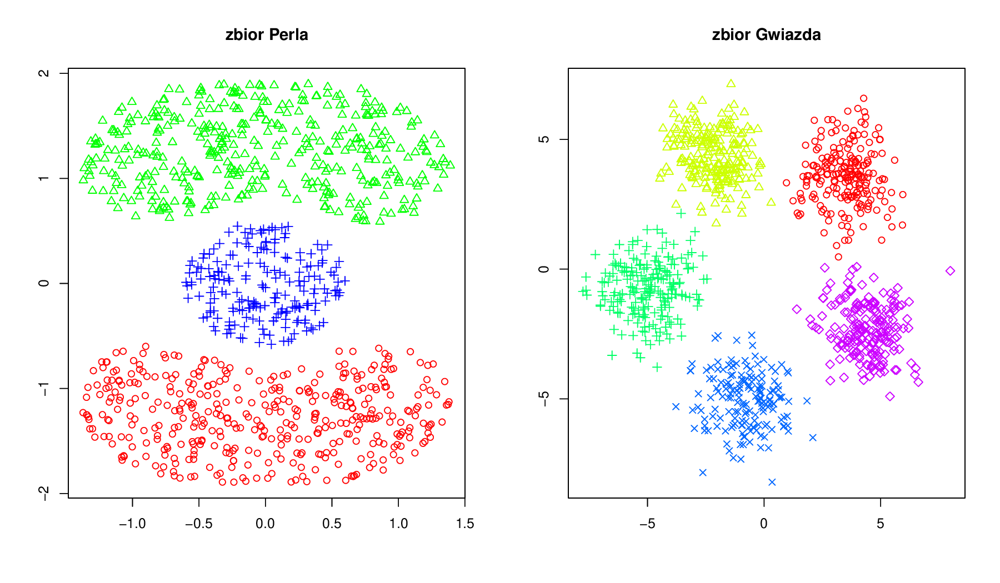
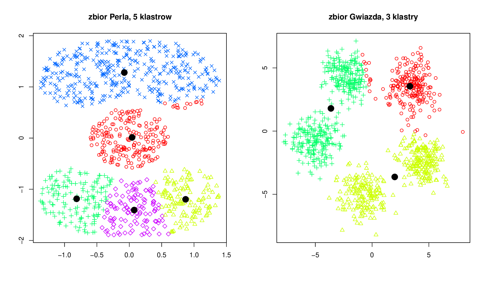

## Metoda k-średnich {#part_31}

Celem tej metody jest podział zbioru danych na `k` klastrów. Dobry podział to taki,
w którym suma odległości obserwacji należących do klastra jest znacznie mniejsza
od sumie odległości obserwacji pomiędzy klastrami. Metoda k-średnich polega na
wyznaczeniu współrzędnych `k` punktów, które zostaną uznane za środki klastrów.
Obserwacja będzie należała do tego klastra, którego środek jest najbliżej niej.

Metoda k-średnich jest zaimplementowana w funkcji `kmeans(stats)`. Pierwszym
argumentem tej funkcji jest ramka danych określająca wartości zmiennych dla kolejnych obserwacji. Drugim argumentem może być pojedyncza liczba określająca ile
klastrów chcemy identyfikować (w tym przypadku środki klastrów będą wyznaczone
iteracyjnym algorytmem) lub wektor środków klastrów. Algorytm wyboru środków
klastrów jest algorytmem zrandomizowanym, może też dawać różne wyniki nawet
na tym samym zbiorze danych! Dlatego też zalecane jest uruchomienie kilkukrotne
tego algorytmu oraz wybranie najlepsze go podziału na klastry. Można to zrobić też
automatycznie, określając argument `nstart` funkcji `kmeans()`.

Algorytm k-średnich minimalizuje $tr(W)$ gdzie $W$ to macierz kowariancji wewnątrz klas. Opisuje go poniższa sekwencja

1. wybierany jest wstępny podział (w razie potrzeby można ten wybór powtórzyć
wielokrotnie by znaleźć globalne maksimum),

2. przypisuje się obiekty do klasy z najbliższym środkiem ciężkości

3. przelicza się środki ciężkości dla nowych klas

4. kroki 2-3 powtarza się tak długo aż nie będą zachodziły żadne zmiany.

```{r mlbench, echo=FALSE, fig.align='center',fig.cap='Dane, na których będziemy przedstawiać metody analizy skupień.', out.width = '100%',fig.pos='h'}

```
Poniżej prezentujemy przykład użycia funkcji `kmeans()`. Wyniki analizy skupień
przedstawione są graficznie na rysunku \@ref(fig:kmeans). Różne klastry zaznaczono punktami
o różnych kształtach. Czarne pełne punkty wskazują na środki znalezionych klastrów. Oczywiście właściwszym byłoby dopasowanie do lewego przykładu 3 klastrów, a do prawego 5 klastrów. Na przedstawionych przykładach możemy prześledzić ci się dzieje, jeżeli źle określimy liczbę klastrów (czytelnik powinien spróbować powtórzyć te analizy, wyniki najprawdopodobniej otrzyma inne!).
```
# szukamy 5 klastrow, nie trafiło się nam najlepsze dopasowanie
> klaster = kmeans(zbiorPerla,5)
# jak wygląda wynik w środku?
# pole $cluster określa numer klastra dla kolejnych punktów, $centers
# określa współrzędne środków klastrów
> str(klaster)
List of 4
$ cluster : int [1:1000] 3 3 3 3 3 3 3 3 3 3 ...
$ centers : num [1:5, 1:2] 0.03203 -0.00749 -0.08380 -0.81601 0.91808
...
..- attr(*, "dimnames")=List of 2
.. ..$ : chr [1:5] "1" "2" "3" "4" ...
.. ..$ : NULL
$ withinss: num [1:5] 22.4 10.9 126.9 11.5
9.8
$ size
: int [1:5] 103 69 197 70 61
- attr(*, "class")= chr "kmeans"
# rysujemy punkty, różne klastry oznaczamy innymi kształtami punktów
> plot(zbiorPerla, pch=klaster$cluster)
# dorysujmy środki klastrów
> points(klaster$centers, cex=2, pch=19)
> klaster = kmeans(zbiorGwiazda,2)
> plot(zbiorGwiazda, pch=klaster$cluster)
> points(klaster$centers, cex=2, pch=19)
```
Na powyższym przykładzie przedstawiliśmy pola w obiektach przekazanych przez
funkcję `kmeans()`. Pole `$cluster` określa do jakiego klastra została przyporządkowana dana obserwacja, a pole `$centers` to współrzędne środków poszczególnych klastrów.
```{r kmeans, echo=FALSE, fig.align='center', fig.cap='Graficzna prezentacja działania funkcji kmeans().', out.width = '100%'}

```

