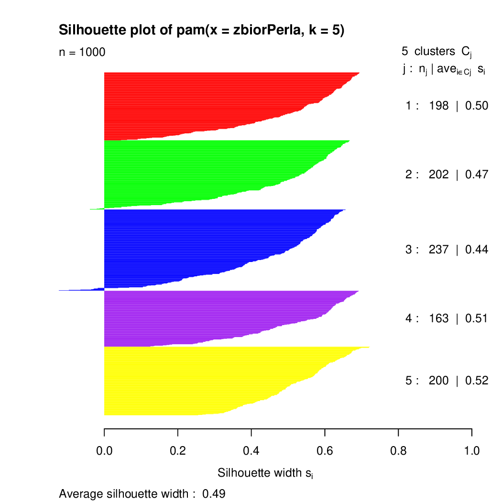

## Inne metody analizy skupień {#part_35}

Poza wymienionymi powyżej trzema metodami, w pakiecie R dostępnych jest wiele
innych metod do analizy skupień. Poniżej wymienimy inne popularne.

* **Metoda hierarchiczej analizy skupień przez dzielenie**. Metoda hierarchicznego klastrowania przez łączenie działała w ten sposób, że zaczynając
od małych, jednopunktowych klastrów w procesie łączenia klastrów otrzymywało się hierarchiczną zależność. Metoda analizy skupień przez dzielenie
działa w przeciwnym kierunku. Zaczynając od jednego dużego klastra, w kolejnych krokach ten klaster jest dzielony na mniejsze klastry, aż do otrzymania jednoelementowych klastrów. Ta metoda jest zaimplementowana w funkcji
`diana(cluster)`.

Algorytm działania metody `diana()` opisany jest poniżej

1. dla każdego skupiska wyznaczamy maksymalną odległość pomiędzy dwo-
ma obserwacjami w skupisku,

2. wybieramy skupisko o największej średnicy, w tym skupisku szukamy
obiektu o największej średniej odległości od pozostałych, to będzie zalążek nowego skupiska,

3. dla każdego obiektu sprawdzamy czy nie jest średnio bliżej obiektom z
klasy nowej niż obiektom z klasy starej, w razie potrzeby zmieniana jest
klasa

4. punkt 3 powtarzany jest tak długo aż nie będzie potrzeby zmieniać przynależności żadnego punktu

* **Metoda klastrowania rozmytego**. Jeżeli w procesie klastrowania dopuszczamy rozmytą przynależność do klastra (np. obserwacja może z pewnymi
współczynnikami przynależeć do różnych klastrów) to uzasadnionym jest użycie metody klastrowania rozmytego. Ta metoda jest zaimplementowana w funkcji `fanny(cluster)`.

* **Inne metody hierarchiczego klastrowania**. Podobna w działaniu do
`agnes()` metoda klastrowania hirarchicznego dostępna w funkcji `hclust(stats)`.
Umożliwia ona większy wybór metody łączenia klastrów. Argumentem method
należy wskazać jeden z wielu dostępnych indeksów do określania odległości pomiędzy klastrami, dostępne są indeksy znane z funkcji `agnes()` oraz `"mcquitty"`,
`"ward"` i `"centroid"`.

Wykonać klastrowanie jest stosunkowo prosto, jednak to jeszcze nie jest koniec
pracy, potrzebne są metody oceny jakości podziału na skupiska. Do oceny jakości
klastrowania można wykorzystać współczynnik silhouette, określający podobieństwo
obiektu do innych obiektów w tym samym klastrze. Ten indeks jest wyznaczany przez
funkcje `silhouette(cluster)`. Poniżej przedstawiamy przykład użycia tej funkcji,
a na rysunku \@ref(fig:silhouette) przedstawiamy dopasowania poszczególnych punktów do klastrów.
Wiele innych metod do oceny wyników klastrowania oraz badania zgodności dwóch
podziałów na klastry jest dostępnych w pakiecie `clv`.
```
> kluster <- pam(zbiorPerla, 5)
> sil <- silhouette(kluster)
> summary(sil)
Silhouette of 1000 units in 5 clusters from pam(x = zbiorPerla, k = 5) :
Cluster sizes and average silhouette widths:
      198       202       237       163       200
0.5005513 0.4711742 0.4402300 0.5146160 0.5240964
Individual silhouette widths:
   Min. 1st Qu.  Median    Mean 3rd Qu.    Max.
-0.1238  0.3895  0.5330  0.4873 0.6111   0.7220
> plot(sil, col = c("red", "green", "blue", "purple","yellow"))
```
```{r silhouette, echo=FALSE, fig.align='center', fig.cap='Wykres dopasowania punktów do poszczególnych klastrów z użyciem miary silhouette.', out.width = '70%'}

```
```{r silhouetteB, echo=FALSE, fig.align='center', fig.cap='Wartości funkcji silhouette dla różnych liczb klastrów wyznaczonych algorytmem PAM na zbiorze danych Gwiazda.', out.width = '70%'}
knitr::include_graphics("silhouetteB.png")
```
Miara silhouette może użyta do wyznaczeniu liczby klastrów, na które należy
podzielić dane. Na rysunku \@ref(fig:silhouetteB) przedstawiono zależność pomiędzy średnim współczynnikiem silhouette a liczbą klastrów wyznaczonych algorytmem PAN dla zbioru danych Gwiazda. W tym przypadku wyraźnie najlepszym wyborem jest 5 klastrów. Niestety w rzeczywistych problemach wybór klastrów nie jest tak prosty.

```{r}
# cztery skupiska, dla pewności inicjujemy 25 razy
#
dane = daneGUS[,c(22:25)]
gus.k4 = kmeans(dane, 4, nstart=25)
cluster::silhouette(gus.k4$clust, dist(dane))[,3]
gus.p4 = cluster::pam(dane, 4)
```
```{r gusp4, fig.cap='', fig.show='hold',fig.pos= 'h', fig.align='center',fig.width=10, fig.height=6,out.width='70%'}
plot(gus.p4)
```

```{r}
# analiza skupień
#
```
```{r pA, fig.cap='', fig.show='hold',fig.pos= 'h', fig.align='center',fig.width=12, fig.height=6,out.width='70%'}
par(mfrow=c(1,3))
h = hclust(dist(dane), method="average")
plot(h)
h = hclust(dist(dane), method="single")
plot(h)
h = hclust(dist(dane), method="complete")
plot(h)
```
```{r pB, fig.cap='', fig.show='hold',fig.pos= 'h', fig.align='center',fig.width=12, fig.height=6,out.width='70%'}
library(cluster)
# cztery przykładowe indeksy
mNiep = daisy(dane)
clustGrid = 2:14
indeksy = matrix(0,length(clustGrid),4)
indeksy[,1] = sapply(clustGrid, function(x) {clusterSim::index.G1(dane, pam(dane, x)$clustering)})
indeksy[,2] = sapply(clustGrid, function(x) {clusterSim::index.Gap(dane, cbind(pam(
dane, x)$clustering, pam(dane, x+1)$clustering))$diffu})
indeksy[,3] = sapply(clustGrid, function(x) {clusterSim::index.G2(mNiep, pam(dane, x)$clustering)})
indeksy[,4] = sapply(clustGrid, function(x) {clusterSim::index.S(mNiep, pam(dane, x)$clustering)})
matplot(clustGrid, scale(indeksy), type="l",lwd=3)
legend("right",c("G1","Gap","G2","S"),lwd=3,bg="white",col=1:4)
```

```{r pC, fig.cap='', fig.show='hold',fig.pos= 'h', fig.align='center',fig.width=12, fig.height=6,out.width='70%'}
# cztery metody porównane indeksem G1
#
clustGrid = 2:10
indeksy = matrix(0,length(clustGrid),5)
indeksy[,1] = sapply(clustGrid, function(x) {clusterSim::index.G1(dane,
              pam(dane, x)$clustering)})
indeksy[,2] = sapply(clustGrid, function(x) {clusterSim::index.G1(dane,
              kmeans(dane, x)$cluster)})
indeksy[,3] = sapply(clustGrid, function(x) {clusterSim::index.G1(dane,     
              cutree(hclust(dist(dane),"average"), k = x))})
indeksy[,4] = sapply(clustGrid, function(x) {clusterSim::index.G1(dane,
              cutree(hclust(dist(dane),"single"), k = x))})
indeksy[,5] = sapply(clustGrid, function(x) {clusterSim::index.G1(dane,
              cutree(hclust(dist(dane),"complete"), k = x))})

matplot(clustGrid, indeksy, type="l",lwd=3)
legend("right",c("PAM","kmeans","hclust av","hclust si","hclust co"),
       lwd=3,bg="white",col=1:5)
```
```{r}
# profile skupień
#
gus.p4 = pam(dane,4)$clustering
desc = clusterSim::cluster.Description(dane, gus.p4)
```
